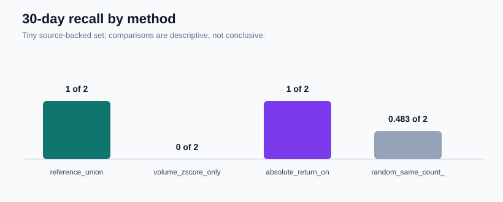
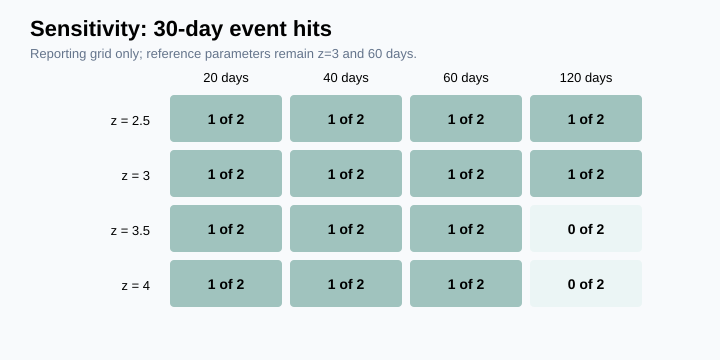
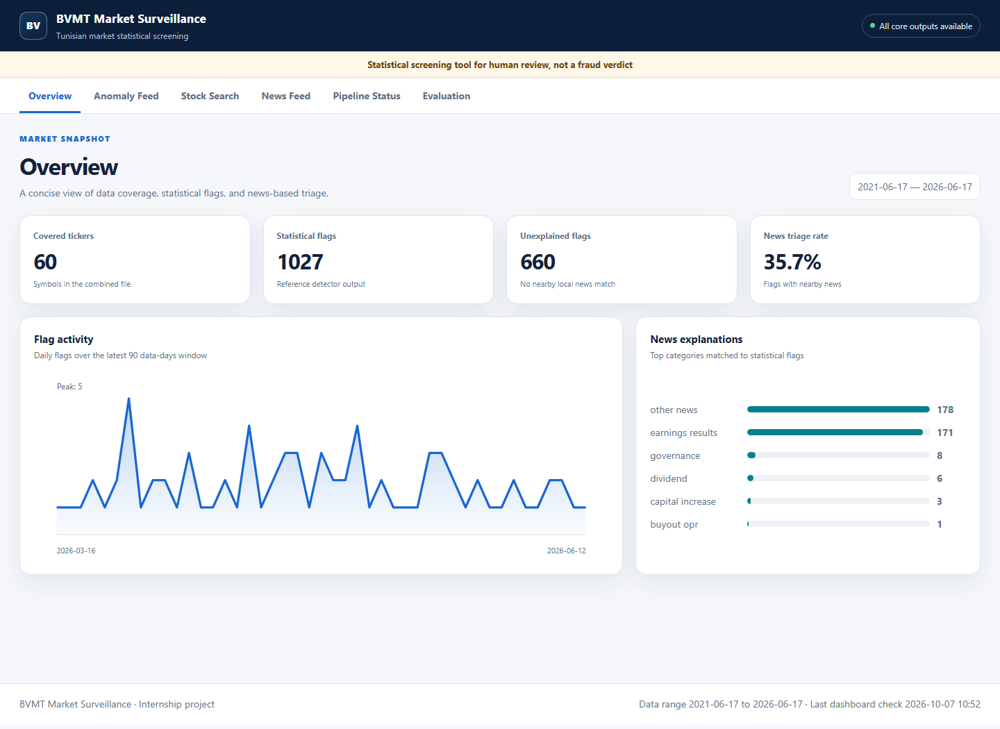

# BVMT Market Surveillance — Project Report

> **Final delivery report**
>
> **Delivered dataset:** 85 local symbols, 61,812 price rows
>
> **Reference screen:** rolling window 60, z-score cutoff 3.0
>
> **Purpose:** statistical screening for human review, not a legal finding

## Plain-English summary

- The project checks local BVMT price and volume history for observations that are unusual relative to each stock's own recent history.
- The delivered 85-symbol run produced 1,454 review flags, 17 refined-watchlist rows, and 17 AI draft assessments.
- Against the small sourced case set, it matched 1 of 2 events in the 30-day window and 1 of 3 events in the 60-day window.
- None of the 20 highest-ranked flags is near either primary-window event; incomplete event labels mean this does not prove those flags are false positives.
- Results are case studies for human review, not a statistical performance estimate or a legal conclusion.

## Abstract

This project builds a transparent statistical screening workflow for the Tunisian stock market. It reads historical price, volume, and news records; flags unusual activity; adds possible public-news context; and presents a review queue in a web dashboard. The delivered reference detector produced 1,454 flags, or 3.681 flags per ticker-year. In a small source-backed evaluation, it matched 1 of 2 positive events in the primary window and 1 of 3 in the secondary window. Every result is a prompt for human review.

## 1. Introduction and context

The Bourse de Valeurs Mobilières de Tunis (BVMT) contains many thinly traded shares. On these shares, a large price or volume movement may be important, but it may also be ordinary market noise. A useful first screening system should therefore be transparent, reproducible, and careful about its claims.

The project has three goals:

1. detect unusual price and volume observations with simple statistical rules;
2. add news and event context so a person can review the flags efficiently; and
3. evaluate the rules honestly against a small, source-audited event set.

The system does not train a machine-learning model. The labeled sample is too small for that approach to be defensible.

### Glossary

- **Z-score:** how far an observation is from a stock's recent average, measured in recent standard deviations.
- **Rolling window:** the moving block of earlier observations used to calculate that recent average and variation.
- **Volume:** the number of shares traded in an observed session.
- **Delisting:** removal of a security from exchange trading.
- **Recall:** how many known, evaluable events had at least one nearby flag, always reported here as “x of n events.”
- **Baseline:** a simpler comparison method used to show whether the reference rule adds useful signal.
- **False positive:** a flag that review later determines is not associated with the event or condition being studied.

## 2. Data

The canonical local data is in `bvmt_data/`. The delivered derived price file, `_all_tickers_full.csv`, contains 61,812 observations for 85 symbols from 17 June 2021 to 17 June 2026. It is rebuilt from the valid individual ticker files before analysis. The protected `_all_tickers_combined.csv` remains unchanged with 44,531 observations for 60 symbols, and the combined news file remains unchanged with 11,850 records.

The 25 price symbols omitted from the protected combined file are AB, ADWYA, AETEC, AL, AMS, ARTES, ASSAD, ASSMA, AST, ATB, ATL, BH, BHASS, BHL, BIAT, BL, BNA, BNASS, BT, BTE, CC, CELL, CREAL, TJARI, and TJL. Repository code showed the cause: the scraper skipped a ticker when its individual CSV already existed but built the combined output only from frames downloaded in that run. The code now rebuilds a combined output from all individual files after a future authorized scrape; no scraper was run for this delivery. UBCI, TINV, and UADH were already present. **CGF and TSI have no ticker files, are not in either price dataset, and cannot be evaluated.**

The evaluation event table is separate at `data/evaluation/events.csv`. Its primary date is the earliest public suspension, court ruling, or first announcement found in repository evidence. It also preserves every original date from `labeled_events.csv` and a later public date where one exists. Missing evidence is written as `SOURCE_NEEDED`; dates are never guessed or moved to improve a result.

## 3. Methods

### 3.1 Statistical screen

The reference detector works independently for each ticker. It uses the previous 60 trading observations as its rolling baseline and excludes the current observation from that baseline, preventing look-ahead.

- Volume is transformed with `log(1 + volume)` before its z-score is calculated. This reduces the effect of very large values in thinly traded shares.
- The volume standard deviation has a floor of 0.10.
- The return standard deviation has a floor of 0.01, equal to a one-point daily return scale.
- A return across a trading gap longer than 10 calendar days is excluded because it is not a true one-day return.
- A volume or absolute-return z-score above 3.0 creates a reference flag.

These parameters were not changed after looking at the labeled events. The 16-cell sensitivity grid is reporting only.

### 3.2 Context and review queue

The next stages cross-reference flags with local news, classify the available context, and produce a smaller watchlist. During the earlier pipeline repair, `watchlist_refined.csv` changed from 107 stale rows to 12 current rows because its input changed to the then-current 12-row `watchlist.csv`; no parameter changed. After adopting the 85-symbol universe, the same unchanged refinement logic produced 17 rows from the new 17-row watchlist.

### 3.3 AI-assisted triage

Groq triage uses `openai/gpt-oss-120b`, configured through `GROQ_MODEL`. An earlier 40-token response used 38 tokens for reasoning and ended with empty visible content. The client now requests a 1,500-token budget, low reasoning effort, and JSON output. Empty content is retried and then skipped safely while preserving the previous output.

The authorized 17-row delivered run used 17 calls under a hard 40-call ceiling. It returned 8 `worth_investigating`, 8 `likely_noise`, and 1 `uncertain` draft assessments, with no empty reasoning fields. These are opinions for human review, never verdicts. The model does not change evaluation labels or detector parameters.

## 4. Evaluation design

The primary hit window was defined before calculation: from 30 calendar days before through 5 days after the event. A secondary view starts 60 days before and ends 5 days after. A positive event is eligible for headline recall only when it has a repository source and enough trading-window coverage.

The reported measures are:

- recall on eligible positive events;
- precision at 10, 20, and 50 ranked flags, ordered by `max(abs(volume_zscore), abs(return_zscore))`, with earlier date and ticker symbol as tie-breaks;
- flags per ticker-year;
- lead-time and coverage detail;
- behavior near the SOPAT negative control; and
- comparison with volume-only, return-only, and same-count random baselines.

This definition of precision is conservative because many real events are not labeled.

### 4.1 Event audit

| Event | Primary date/type | Original label | Secondary date | Source/confidence | Evaluable | Reason |
|---|---|---|---|---|---|---|
| TINV | 2025-10-06, other | 2025-10-06 | — | `SOURCE_NEEDED`, low | No | No supporting repository source |
| UADH | 2026-03-24, suspension | 2026-03-24 | — | `SOURCE_NEEDED`, low | No | No supporting repository source |
| TSI | —, other | — | — | `SOURCE_NEEDED`, not assessed | No | No ticker data; cannot be evaluated |
| CGF | —, other | — | — | `SOURCE_NEEDED`, not assessed | No | No ticker data; cannot be evaluated |
| UBCI | —, other | — | — | `SOURCE_NEEDED`, not assessed | No | No event date or supporting source |
| GIF Filter | 2024-10-25, suspension | 2024-10-25 | 2024-11-12 | [IlBoursa](https://www.ilboursa.com/marches/la-bourse-de-tunis-decide-la-radiation-de-la-societe-gif-filter_49247), high | Yes | Source and primary-window coverage available |
| Electrostar (LSTR) | 2024-07-23, suspension | 2024-07-23 | 2024-07-24 | [IlBoursa](https://www.ilboursa.com/marches/en-cessation-de-paiement-le-tribunal-declare-la-faillite-de-la-societe-electrostar_47391), high | Yes | Source and primary-window coverage available |
| Servicom (SERVI) | 2024-01-11, suspension | 2024-01-11 | 2024-03-27 | [IlBoursa](https://www.ilboursa.com/marches/le-tribunal-de-tunis-declare-la-faillite-de-la-societe-servicom_45451), high | No | Trading data ends before the primary window |
| MIP | 2024-08-05, public announcement | 2024-09-10 | 2024-09-10 | [IlBoursa](https://www.ilboursa.com/marches/vers-la-mise-en-faillite-directe-de-la-societe-mip_47579), medium | No | Exploratory event excluded from headline metrics |
| SOPAT | 2023-09-19, public announcement | 2023-09-20 | 2023-09-20 | [IlBoursa](https://www.ilboursa.com/marches/le-groupe-la-rose-blanche-retire-la-sopat-de-la-cote-de-la-bourse_42686), high | No | Negative control, not a positive event |

The TINV label remains 6 October 2025. Its stored date type is `other`, explicitly not `public_announcement`, and it has no supporting repository source. The detector flags on 13 October and 22 October 2025 are after the label. The date was not moved to improve the result.

## 5. Results

There are 3 source-backed positive events. The 30-day denominator is 2 because GIF and LSTR have trading observations in that window, while SERVI's trading data ends on 30 November 2023, before its 30-day window begins. The 60-day window starts early enough to overlap SERVI's last observations, so its denominator is 3. The reference detector matched 1 of 2 events in the primary window and 1 of 3 events in the secondary window.

| Method | Flags | Flags per ticker-year | Recall, -30/+5 | Recall, -60/+5 | Precision at 20 | SOPAT-window flags |
|---|---:|---:|---:|---:|---:|---:|
| Reference union | 1,454 | 3.681 | 1 of 2 events | 1 of 3 events | 0 of 20 flags | 0 flags in 1 window |
| Volume z-score only | 206 | 0.521 | 0 of 2 events | 0 of 3 events | 0 of 20 flags | 0 flags in 1 window |
| Absolute return only | 1,269 | 3.212 | 1 of 2 events | 1 of 3 events | 0 of 20 flags | 0 flags in 1 window |
| Random, same count, mean of 1,000 seeds | 1,454 | 3.681 | 0.483 of 2 events on average | 0.908 of 3 events on average | 0.008 of 20 flags on average | 0.548 flags in 1 window on average |

For the reference detector, precision at 10, 20, and 50 is 0 of 10, 0 of 20, and 0 of 50 ranked flags. The **0 of 20** result means none of the 20 largest ranking scores occurs inside the fixed primary window around GIF or LSTR. It does not establish that those 20 flags are false positives because the event list is small and incomplete.

GIF is the only reference hit. Its first matching flag is 22 October 2024: 3 days before the primary suspension date of 25 October and 21 days before the secondary article date of 12 November.

The reference detector does not beat the absolute-return-only baseline on recall or precision. Both match 1 of 2 events in the primary window, 1 of 3 events in the secondary window, and 0 of 20 top-ranked flags, while the reference produces 1,454 flags and the return-only baseline produces 1,269. The reference matches more events than the volume-only baseline, but with a much larger review load.

The sensitivity grid contains 16 parameter combinations. Primary recall remains 1 of 2 events in 14 cells. It becomes 0 of 2 events only for a 120-day window with z cutoffs of 3.5 and 4.0. Flag load ranges from 473 to 2,673. This grid was not used to choose a new reference setting.

### 5.1 Ranking and top 20

Flags are ranked by `max(abs(volume_zscore), abs(return_zscore))`, highest first. Ties use earlier date and then ticker symbol. “Illiquid” means the ticker's median daily volume is at or below 349.5 shares, the 25th percentile across the 83 tickers represented in delivered reference flags. This liquidity label does not affect the ranking or detector.

| Rank | Ticker | Date | Ranking z-score | Illiquid |
|---:|---|---|---:|---|
| 1 | ASSAD | 2021-09-01 | 38.907 | No |
| 2 | MIP | 2022-03-24 | 25.000 | Yes |
| 3 | CITY | 2026-04-27 | 21.748 | No |
| 4 | CITY | 2026-04-28 | 19.703 | No |
| 5 | BT | 2022-05-10 | 18.598 | No |
| 6 | PGH | 2021-11-30 | 17.375 | No |
| 7 | ADWYA | 2022-06-13 | 16.933 | No |
| 8 | SOMOC | 2025-05-13 | 14.704 | No |
| 9 | TJARI | 2023-04-05 | 12.247 | No |
| 10 | SAM | 2023-04-20 | 12.180 | No |
| 11 | STAR | 2025-03-12 | 11.987 | No |
| 12 | SIPHA | 2023-11-29 | 11.937 | Yes |
| 13 | ARTES | 2023-07-31 | 11.690 | No |
| 14 | ICF | 2022-09-01 | 11.664 | No |
| 15 | SOTET | 2025-07-29 | 11.502 | No |
| 16 | BNA | 2025-06-17 | 11.060 | No |
| 17 | ARTES | 2022-07-06 | 11.018 | No |
| 18 | TINV | 2025-10-22 | 10.880 | Yes |
| 19 | BIAT | 2024-11-29 | 10.447 | No |
| 20 | NBL | 2025-06-11 | 9.959 | No |

### 5.2 Coverage comparison

All 85 individual files pass the delivered build's input checks. PLTU has only 41 observations and is excluded from the reference anomaly detector as known-incomplete. The 85-symbol derived file adds the 25 valid omitted symbols without changing raw inputs. Shared OHLCV values and resulting detector flags agree across all 60 shared symbols.

| Universe | Symbols | Rows | Flags | Flags per ticker-year | Recall, -30/+5 | Recall, -60/+5 | Precision at 20 |
|---|---:|---:|---:|---:|---:|---:|---:|
| Archived earlier run | 60 | 44,531 | 1,027 | 3.607 | 1 of 2 events | 1 of 3 events | 0 of 20 flags |
| Delivered reference | 85 | 61,812 | 1,454 | 3.681 | 1 of 2 events | 1 of 3 events | 0 of 20 flags |

The added 25 symbols increase the review load by 427 flags but do not change the reported recall or precision at 20. The 85-symbol run is the delivered reference; the 60-symbol tables are archived under `outputs/evaluation_60symbol/`.



*Figure 1. Primary-window event hits for the delivered reference and three simple baselines. Counts are descriptive because the evaluable sample is very small.*



*Figure 2. Event-hit counts across the fixed reporting grid. The grid was not used to change the reference parameters.*

## 6. Dashboard

The Flask dashboard has six English pages: Overview, Anomaly Feed, Stock Search, News Feed, Pipeline Status, and Evaluation. The two previously reported chart failures were not reproducible through their APIs. The old dashboard depended on external Chart.js delivery, so the final version replaces it with native SVG and CSS charts. The browser test showed distinct content on all six pages and no console warning or error.



*Figure 3. Dashboard Overview page using the delivered local outputs. Other requested page captures are listed as TODOs rather than linked as missing images.*

## 7. Limitations

- The headline denominator is only 2 evaluable positive events in the primary window and 3 in the secondary window; this is too small for a general performance estimate.
- Exact binomial intervals would be extremely wide and would not solve the evidence problem.
- Five positive cases remain `SOURCE_NEEDED`.
- CGF and TSI are not present in the price dataset and cannot be evaluated; they must not be interpreted as tested misses.
- There is no independent test set.
- The original reference parameters were hand chosen, although they were not tuned on this event set.
- Delisted firms can lose trading coverage before an event.
- The available files may have survivorship bias and missing public-news context.
- The protected 60-symbol combined file omitted 25 valid individual ticker files because of the scraper merge bug; the delivered derived file corrects coverage, but future data refreshes still require review.
- The ranked precision calculation underestimates unknown relevant cases.
- AI triage depends on an external model and can be inconsistent; its output requires human review.

## 8. Conclusion and future work

The project now provides a clean, reproducible screening workflow with explicit assumptions and an honest evaluation. Its strongest feature is transparency: each flag can be traced to a simple rule, each event has a source status, and missing evidence is not hidden.

Future work should expand the independently sourced event set, add formal market-calendar event studies, record disclosure timestamps, compare additional robust statistics, and evaluate on a later untouched period. A trained model should be considered only after a much larger labeled dataset exists.

## 9. Reproducibility

From the repository root:

```bash
python -m venv .venv
# Activate the environment, then:
python -m pip install -r requirements.txt
python run_all.py --skip-ai
python -m pytest -q
python app.py
```

`python run_all.py` includes optional AI triage but still uses existing local data. Scraping requires the explicit `--with-scrape` flag and was not used for this delivery.

Generated 85-symbol evaluation files are in `outputs/evaluation/`. The main tables are `events_table.csv`, `metrics.csv`, `baseline_comparison.csv`, `sensitivity.csv`, `top_20_flags.csv`, and `universe_comparison.csv`. The earlier 60-symbol outputs remain in `outputs/evaluation_60symbol/`.

## 10. References and data sources

- Local BVMT price and news extracts in `bvmt_data/`.
- Source URLs preserved in `data/evaluation/events.csv` and listed in the event audit above.
- Project methods and fixed parameters in `src/detection/anomaly_detector.py` and `src/evaluation/`.
- Full generated evaluation statement in `outputs/evaluation/summary.md`.

## Screenshot TODO

The following captures are intentionally not linked until real files are supplied:

- Anomaly Feed
- Stock Search
- News Feed
- Pipeline Status
- Evaluation
